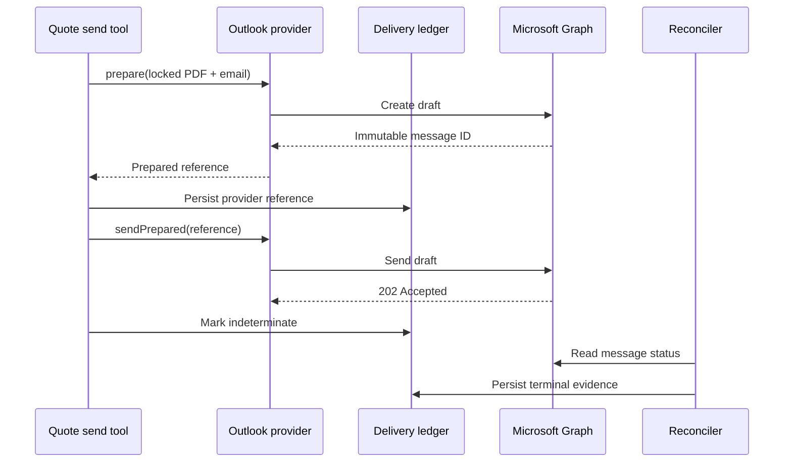

# Outlook quote draft provider design

**Date:** 2026-07-28  
**Status:** Approved scope; implementation unactivated

## Objective

Add a Microsoft Graph provider for approved, finalised quotes that prepares a draft containing the immutable quote PDF, persists the provider reference before the risky send step, and leaves terminal delivery proof to the existing reconciliation worker.

## Authority boundary

This slice adds code and tests only. It does not configure OAuth, request Microsoft permissions, call Graph, send email, or deploy production. Runtime composition remains disabled by default.

## Safety contract

1. Only approved, finalised quotes may reach the provider.
2. The attachment is the locked PDF artefact for the approved revision and fingerprint.
3. Draft creation and draft sending are separate operations.
4. The immutable Graph message ID is persisted in the delivery ledger before sending.
5. Graph `202 Accepted` is not delivery proof. The attempt becomes indeterminate until reconciliation observes a sent message.
6. Unknown or malformed responses fail closed with stable redacted error codes.
7. Tokens, recipients, message bodies, attachment bytes, and Graph response bodies never appear in errors or logs.
8. Cancellation, timeouts, redirects, size limits, and content validation are explicit.
9. Provider construction and runtime composition remain unavailable without separately approved credentials and activation.

## Protocol

## Components

- Extend the quote email provider contract with explicit `prepare` and `sendPrepared` phases.
- Add an immutable PDF attachment value object with filename, media type, digest, and bytes.
- Add a Microsoft Graph provider with injected token supplier and fetch implementation.
- Use `Prefer: IdType="ImmutableId"` for both draft creation and sending.
- Create a plain-text message with one `#microsoft.graph.fileAttachment`.
- Require `Mail.Send` only at the later activation boundary.
- Keep the provider factory returning `null` until activation is separately authorised.

## Failure semantics

- Draft creation failure before a usable ID: fail closed; no send occurs.
- Draft ID returned: register it durably before any send.
- Send timeout, abort, network ambiguity, or `202 Accepted`: indeterminate and reconciled.
- Definitive pre-send validation failures: failed.
- Reconciliation remains the sole authority for succeeded delivery.

## Tests

- Strict constructor and input validation.
- Exact URL encoding, headers, method, body, attachment bytes, digest, and filename.
- Immutable ID capture.
- No send before the reference-registration callback completes.
- `202` maps to accepted/indeterminate, never succeeded.
- Abort, timeout, redirect, malformed JSON, missing ID, non-2xx, and token failures.
- Redaction assertions.
- No live network use.
