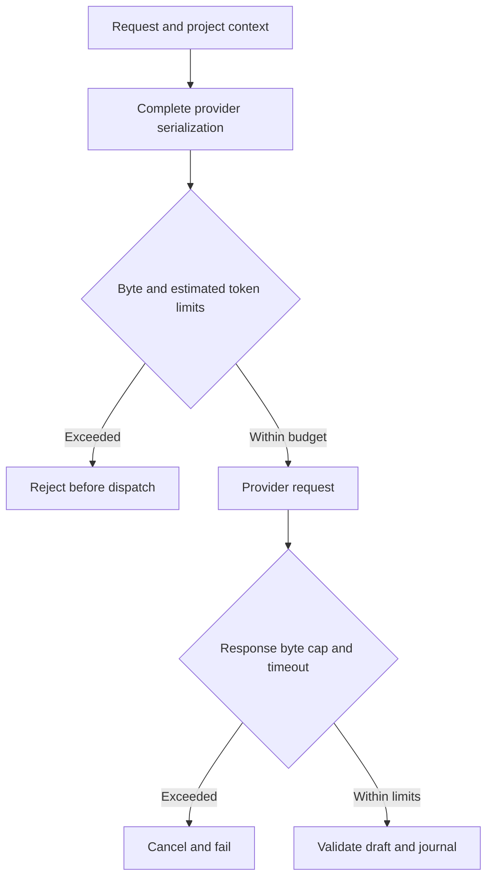

# OpenClaw v2026.9.5 acquisition for Jarvis

Mission [#574](https://github.com/Benny3840RG/Jarvis/issues/574).
Upstream tag `v2026.9.5` resolves to `ec9c1a13db8938e5a3eaa51fca2e981cde2395a9`.
Jarvis base inspected: `f9acc2776a856a9737dd4c532c83fb661f32643b`.

## Acquired and integrated

These are narrow adaptations into the existing Totality pipeline, with no
OpenClaw runtime, plugin installation, model change or added dependency.

| Upstream pattern                                                       | Jarvis integration                                                                   | Observable result                                                                                                                                                |
| ---------------------------------------------------------------------- | ------------------------------------------------------------------------------------ | ---------------------------------------------------------------------------------------------------------------------------------------------------------------- |
| Account for fixed instructions and added context at the model boundary | `TotalityReasoner.serializeRequest`, `TotalityPipeline.run`, `TotalityQuota.acquire` | Project summary, routing, system instructions, output schema and JSON overhead count before dispatch. Incoming and outgoing bodies each retain the byte ceiling. |
| Bound response consumption and release readers on failure              | `integrations/boundedResponse.ts`, OpenAI and Gemini reasoners                       | Both success and error bodies stop above 1,048,576 actual streamed bytes. Missing or understated Content-Length does not bypass the cap.                         |
| Keep cancellation effective after headers                              | Bounded reader consumes the existing provider timeout signal                         | A stalled body can be cancelled; reader cleanup does not wait for potentially hung stream cancellation.                                                          |

Every reasoner must supply its full wire serializer, including instructions,
schema and other provider overhead. The production adapters use the same
serializer for quota accounting and their HTTP body. An injected reasoner without
a serializer fails before quota admission, dispatch or outcome journalling.
Quota admission and the synchronous dispatch serialization have no intervening
await. Provider credentials stay in headers and are excluded from serialization.

Oversized context is rejected whole. No stored measurements, constraints or
memory are silently trimmed. Token usage remains the existing
`ceil(providerBodyUtf8Bytes / 4)` estimate; it is not exact tokenization or a
currency cap. The budget includes reserved maximum output. Rejected input
consumes no allowance; a dispatched call keeps its reservation after failure.
Counters remain in-process and reset on restart. A response overflow is a
non-retryable processing failure, with no automatic additional model call.

## Pinned provenance

- [Compaction request accounting](https://github.com/openclaw/openclaw/blob/ec9c1a13db8938e5a3eaa51fca2e981cde2395a9/src/agents/sessions/compaction/request-budget.ts)
  and [its regressions](https://github.com/openclaw/openclaw/blob/ec9c1a13db8938e5a3eaa51fca2e981cde2395a9/src/agents/sessions/compaction/request-budget.test.ts):
  fixed prompt and newly attached context are independently charged. Jarvis
  adapts the boundary-accounting principle, not OpenClaw's compaction runtime.
- [Model-boundary estimator](https://github.com/openclaw/openclaw/blob/ec9c1a13db8938e5a3eaa51fca2e981cde2395a9/src/agents/sessions/context-token-pressure.ts):
  inspected during acquisition; its model/message dependencies and CJK lookup
  tables are not imported.
- [Bounded HTTP body reader](https://github.com/openclaw/openclaw/blob/ec9c1a13db8938e5a3eaa51fca2e981cde2395a9/src/infra/http-response-body.ts),
  [tests](https://github.com/openclaw/openclaw/blob/ec9c1a13db8938e5a3eaa51fca2e981cde2395a9/packages/media-core/src/read-byte-stream-with-limit.test.ts), and
  [byte-stream reader](https://github.com/openclaw/openclaw/blob/ec9c1a13db8938e5a3eaa51fca2e981cde2395a9/packages/media-core/src/read-byte-stream-with-limit.ts):
  bounded byte counting, cancellation without waiting for teardown and reader
  release adapted for Jarvis's Node 24 native fetch. Jarvis omits unbounded
  arrayBuffer fallbacks and rejects overflow rather than parsing a prefix.

OpenClaw is MIT, copyright 2026 OpenClaw Foundation. The pinned
[licence](../../../docs/third-party/openclaw/LICENSE) and
[upstream third-party notices](../../../docs/third-party/openclaw/THIRD_PARTY_NOTICES.md)
are retained for provenance. Upstream notices also describe Pi/pi-mono and
Octicons; preserving that file does not mean those packages or icons were added.

The release page links to a moving main-branch changelog. Only the pinned commit
was used as implementation evidence. The release notes disclose waived stable
live/E2E soak: that is not Jarvis validation evidence.

## Inspected and deferred

| Component                                                                                                                                                   | Decision and remaining work                                                                                                                                                                                                                                          |
| ----------------------------------------------------------------------------------------------------------------------------------------------------------- | -------------------------------------------------------------------------------------------------------------------------------------------------------------------------------------------------------------------------------------------------------------------- |
| [Abortable retry/backoff](https://github.com/openclaw/openclaw/blob/ec9c1a13db8938e5a3eaa51fca2e981cde2395a9/packages/retry/src/index.ts)                   | Do not auto-retry paid model requests or external actions. Upstream has permissive defaults, including an unlimited RetrySupervisor and retry-all classification. Adoption needs per-attempt budget reservation, operation-specific idempotency and ambiguity rules. |
| [Rendered project-memory bounds](https://github.com/openclaw/openclaw/blob/ec9c1a13db8938e5a3eaa51fca2e981cde2395a9/src/agents/project-memory-bootstrap.ts) | Useful later for selected memory injection. This change rejects excess context; selecting/truncating trusted project information needs its own product contract and provenance tests.                                                                                |
| [Terminal provider outcome classification](https://github.com/openclaw/openclaw/blob/ec9c1a13db8938e5a3eaa51fca2e981cde2395a9/src/llm/utils/retry.ts)       | Preserve no-blind-retry rules. Map structured refusal/partial-output outcomes to Jarvis before considering retries.                                                                                                                                                  |
| [Redirect credential controls](https://github.com/openclaw/openclaw/blob/ec9c1a13db8938e5a3eaa51fca2e981cde2395a9/src/infra/net/redirect-headers.ts)        | Candidate for a future arbitrary-URL fetch adapter. Existing model URLs are fixed. Full OpenClaw SSRF/proxy infrastructure has substantial dependencies and is not imported.                                                                                         |
| [Tool loop detection](https://github.com/openclaw/openclaw/blob/ec9c1a13db8938e5a3eaa51fca2e981cde2395a9/src/agents/tool-loop-detection.ts)                 | Keep for pressure-testing future model-driven tool loops. Jarvis already has execution claims, bounded development attempts and external reconciliation; no replacement governance engine.                                                                           |
| Atomic updater, plugin hot-loading, specialist teams, browser and voice stack                                                                               | Not imported. These need separately scoped integration and deployment/rollback proof, and overlap existing Jarvis infrastructure.                                                                                                                                    |

The follow-up candidate preserves provider Retry-After minimum waits and gives
MCP backend calls a default deadline plus disconnect cancellation. Graph parsing
accepts delta-seconds and IMF-fixdate values and does not drop a longer wait.
The reconciliation worker treats that delay as a floor: local backoff may wait
longer, and an unrepresentable delay escalates instead of retrying early.
`JarvisApiClient` aborts its outbound HTTP call at the configured deadline or
when the MCP request signal aborts. Aborting that call does not roll back a
Jarvis HTTP mutation that has already been accepted.

## Caller-disconnect follow-up

Inspected again on 2026-09-23, without importing OpenClaw runtime code.

| Pin       | Commit                                     | What was read                                                                                                                                                                                                                                                                                                                              |
| --------- | ------------------------------------------ | ------------------------------------------------------------------------------------------------------------------------------------------------------------------------------------------------------------------------------------------------------------------------------------------------------------------------------------------ |
| v2026.9.5 | `ec9c1a13db8938e5a3eaa51fca2e981cde2395a9` | `src/shared/async-work-scope.ts` already separates caller-owned work from `runOutsideAsyncWorkScope`. `src/infra/http-response-body-timeout.ts` cancels a reader when its signal aborts.                                                                                                                                                   |
| v2026.9.6 | `eb377ac59e6c9fd6c7705028034812becf00271b` | The same split is clearer: `GatewayRequestOptions.signal` is an in-process caller lifetime and is never serialized into a request frame. Voice selection throws when that signal is aborted. `runOutsideAsyncWorkScope` still means the caller neither waits for the work nor closes it. No cleaner portable pattern replaced AbortSignal. |

Jarvis adaptation, Totality only:

- `bindCallerDisconnect` aborts when the HTTP response closes before it finishes.
- `TotalityPipeline.run` passes that signal to the reasoner and to request-bound delegations.
- OpenAI and Gemini combine it with the existing provider timeout and pass it to `readBoundedResponseText`.
- `durable: true` delegations are started with `signalForWork("durable")`, which returns no caller signal. They are not awaited by the turn.
- A journal `commitOutcome` that has already started is left to finish.
- Work is not admitted when the caller is already aborted, or when authority, project resolution or quota admission fails.

Not adopted: OpenClaw `AsyncWorkScope` / `AsyncLocalStorage`, the retry supervisor, gateway sockets, voice selection, cron, or worker placement. Provider quotas remain in-process. No live Graph, ChatGPT, model, or deployment proof is claimed here.

Still open: provider quotas are not durable across processes. Directory-entry fsync was already recorded in the roadmap.

## Validation and authority

Failure-first regressions cover excessive stored context, provider overhead,
UTF-8 byte boundaries, cost reservations, oversized success/error bodies,
misleading length headers, cancellation and normal responses. Each provider's
serialization test compares the budgeted body with the actual dispatched body.
Run the maintained `npm run check` plus focused tests; current candidate results
are recorded in the draft PR rather than inferred from the upstream release.

No live OpenAI/Gemini request, host commissioning, merge or deployment is part
of acquisition. Independent in-session review is supplementary; external Claude
review and the exact-head Jarvis PASS remain distinct gates. Benny retains merge
and deployment authority.
